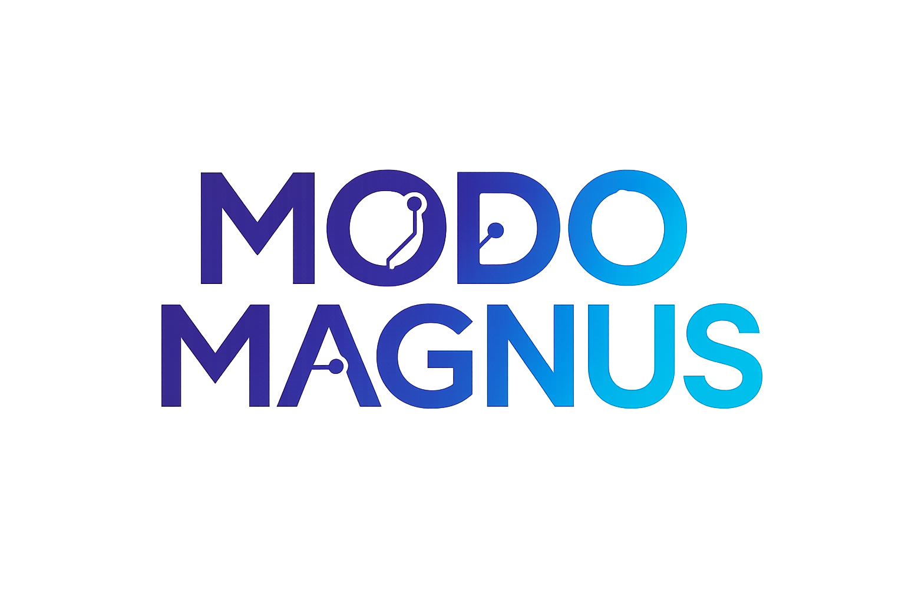

# 🚀 Modo Magnus - Landing Page

Landing page profissional de alta conversão para o curso **Modo Magnus**, que ensina pessoas a criarem landing pages com chatbot e banco de dados sem programar.



## 📋 Sobre o Projeto

Esta é uma landing page moderna e otimizada para conversão, desenvolvida com as melhores práticas de UX/UI e tecnologias web modernas. O projeto demonstra exatamente o que os alunos aprenderão no curso Modo Magnus.

### ✨ Características Principais

- 🎨 **Design Moderno**: Interface clean com gradientes roxo e ciano
- 💬 **Chatbot Inteligente**: Assistente virtual 24/7 integrado com Google Gemini API
- 📊 **Captura de Leads**: Formulário integrado com banco de dados
- ⏰ **Contador Regressivo**: Urgência para promoção Black Friday
- 📱 **Totalmente Responsivo**: Otimizado para mobile, tablet e desktop
- ⚡ **Performance**: Carregamento rápido e animações suaves
- 🔒 **Segurança**: Validação de formulários e proteção de dados

## 🛠️ Tecnologias Utilizadas

### Frontend
- **React 19** - Biblioteca JavaScript para interfaces
- **TypeScript** - Tipagem estática
- **Tailwind CSS 4** - Framework CSS utilitário
- **Vite** - Build tool moderna e rápida
- **shadcn/ui** - Componentes UI acessíveis
- **Wouter** - Roteamento leve
- **Streamdown** - Renderização de markdown

### Backend
- **Express 4** - Framework Node.js
- **tRPC 11** - Type-safe APIs
- **Drizzle ORM** - ORM TypeScript-first
- **MySQL/TiDB** - Banco de dados relacional

### Integrações
- **Google Gemini API** - IA para chatbot
- **Manus Auth** - Autenticação OAuth
- **Manus Storage** - Armazenamento S3

## 📁 Estrutura do Projeto

```
modo-magnus-landing/
├── client/                    # Frontend React
│   ├── public/               # Assets estáticos
│   │   ├── logo_modo_magnus.png
│   │   ├── hero_image_1.png
│   │   └── feature_*.png
│   └── src/
│       ├── components/
│       │   ├── landing/      # Componentes da landing page
│       │   │   ├── Header.tsx
│       │   │   ├── HeroSection.tsx
│       │   │   ├── FeaturesSection.tsx
│       │   │   ├── BenefitsSection.tsx
│       │   │   ├── GuaranteeSection.tsx
│       │   │   ├── PricingSection.tsx
│       │   │   ├── FAQSection.tsx
│       │   │   ├── ContactSection.tsx
│       │   │   ├── Footer.tsx
│       │   │   └── ChatbotWidget.tsx
│       │   └── ui/           # Componentes shadcn/ui
│       ├── pages/
│       │   └── Home.tsx      # Página principal
│       ├── lib/
│       │   └── trpc.ts       # Cliente tRPC
│       └── index.css         # Estilos globais
├── server/
│   ├── routers.ts            # Rotas tRPC
│   ├── db.ts                 # Funções de banco de dados
│   └── _core/                # Core do servidor
├── drizzle/
│   └── schema.ts             # Schema do banco de dados
└── todo.md                   # Checklist do projeto
```

## 🚀 Como Executar

### Pré-requisitos

- Node.js 18+
- pnpm (gerenciador de pacotes)
- Conta Manus (para deploy)

### Instalação

1. Clone o repositório:
```bash
git clone https://github.com/magnusimports/landingPageModoMagnus.git
cd landingPageModoMagnus
```

2. Instale as dependências:
```bash
pnpm install
```

3. Configure as variáveis de ambiente (já configuradas no Manus):
```env
DATABASE_URL=sua_url_mysql
GEMINI_API_KEY=sua_chave_gemini
```

4. Execute as migrações do banco:
```bash
pnpm db:push
```

5. Inicie o servidor de desenvolvimento:
```bash
pnpm dev
```

6. Acesse http://localhost:3000

## 📊 Banco de Dados

### Tabelas

#### `users`
- Usuários autenticados via Manus OAuth
- Campos: id, openId, name, email, role, etc.

#### `leads`
- Leads capturados pelo formulário
- Campos: id, name, email, phone, message, status, createdAt

#### `chatMessages`
- Histórico de conversas do chatbot
- Campos: id, sessionId, role, content, createdAt

## 🎯 Funcionalidades

### 1. Hero Section
- Headline impactante com gradiente
- CTA principal destacado
- Prova social (estatísticas)
- Imagem hero animada

### 2. Features Section
- 6 funcionalidades principais
- Cards com hover effects
- Imagens ilustrativas

### 3. Benefits Section
- Lista de 10 benefícios
- Estatísticas de sucesso
- Mockup visual

### 4. Guarantee Section
- Garantia "O Dobro ou Nada"
- Destaque para R$ 500 de compensação
- 3 pilares da garantia

### 5. Pricing Section
- Preço promocional: R$ 499 → R$ 150
- Contador regressivo animado
- Lista completa do que está incluído
- Parcelamento em 12x

### 6. FAQ Section
- 10 perguntas frequentes
- Accordion interativo
- CTA para chatbot

### 7. Contact Section
- Formulário de captura de leads
- Validação em tempo real
- Feedback visual (toast)
- Integração com banco de dados

### 8. Chatbot Widget
- Botão flutuante
- Interface de chat moderna
- Integração com Gemini API
- Histórico de conversas
- Respostas em markdown

## 🎨 Design System

### Cores

```css
--primary: 263 70% 50%      /* Roxo #6B46C1 */
--accent: 190 100% 44%      /* Ciano #00D9FF */
--background: oklch(1 0 0)  /* Branco */
--foreground: oklch(0.235)  /* Preto suave */
```

### Tipografia

- Fonte: Inter (Google Fonts)
- Pesos: 300, 400, 500, 600, 700, 800, 900

### Componentes

Todos os componentes UI são do shadcn/ui:
- Button, Card, Input, Label, Textarea
- Accordion, ScrollArea, Dialog
- Toast (Sonner)

## 📈 Otimizações de Conversão

1. **Urgência**: Contador regressivo e badges de oferta limitada
2. **Prova Social**: Estatísticas e número de alunos
3. **Garantia Forte**: Dobro do dinheiro de volta
4. **CTAs Claros**: Botões destacados em todas as seções
5. **Scroll Suave**: Navegação fluida entre seções
6. **Animações**: Fade-in, float, hover effects
7. **Responsividade**: Mobile-first design
8. **Performance**: Lazy loading e otimização de imagens

## 🔧 Scripts Disponíveis

```bash
pnpm dev          # Inicia servidor de desenvolvimento
pnpm build        # Build para produção
pnpm preview      # Preview do build
pnpm db:push      # Aplica migrações do banco
pnpm lint         # Executa linter
```

## 📝 Roadmap

- [x] Estrutura básica da landing page
- [x] Integração com chatbot Gemini
- [x] Formulário de captura de leads
- [x] Design responsivo
- [x] Animações e transições
- [ ] Integração com gateway de pagamento
- [ ] Painel administrativo para leads
- [ ] Testes A/B
- [ ] Analytics avançado

## 🤝 Contribuindo

Contribuições são bem-vindas! Sinta-se à vontade para abrir issues e pull requests.

## 📄 Licença

Este projeto é privado e propriedade da Magnus Imports.

## 📞 Contato

- Email: contato@modomagunus.com
- Website: [Em breve]

---

**Desenvolvido com 💜 pela equipe Modo Magnus**
